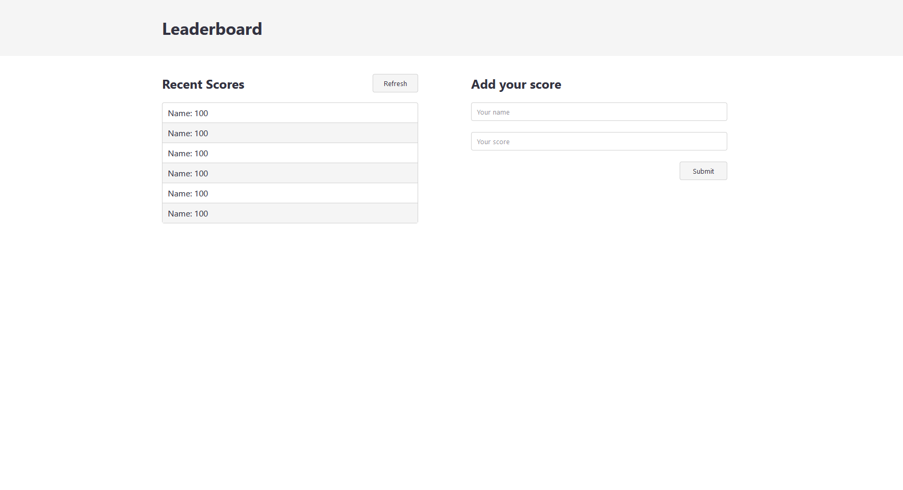

# Leaderboard

> A simple leaderboard made with the leaderboard API and webpacker for Microverse.

Additional description about the project and its features.

## Built With

- HTML/CSS
- Javascript
- Webpacker
- NPM

## Getting Started

### Install

- `git clone https://github.com/fernandorpm/leaderboard.git`
- `cd leaderboard`
- `npm install`
- `npm run start`

## Authors

👤 **Fernando R P Marques**

- GitHub: [@fernandorpm](https://github.com/fernandorpm)
- Twitter: [@rpm_fernando](https://twitter.com/rpm_fernando)
- LinkedIn: [Fernando R P Marques](https://linkedin.com/in/fernandorpm)

## 🤝 Contributing

Contributions, issues, and feature requests are welcome!

Feel free to check the [issues page](../../issues/).

## Show your support

Give a ⭐️ if you like this project!

## 📝 License

This project is [MIT](./MIT.md) licensed.
